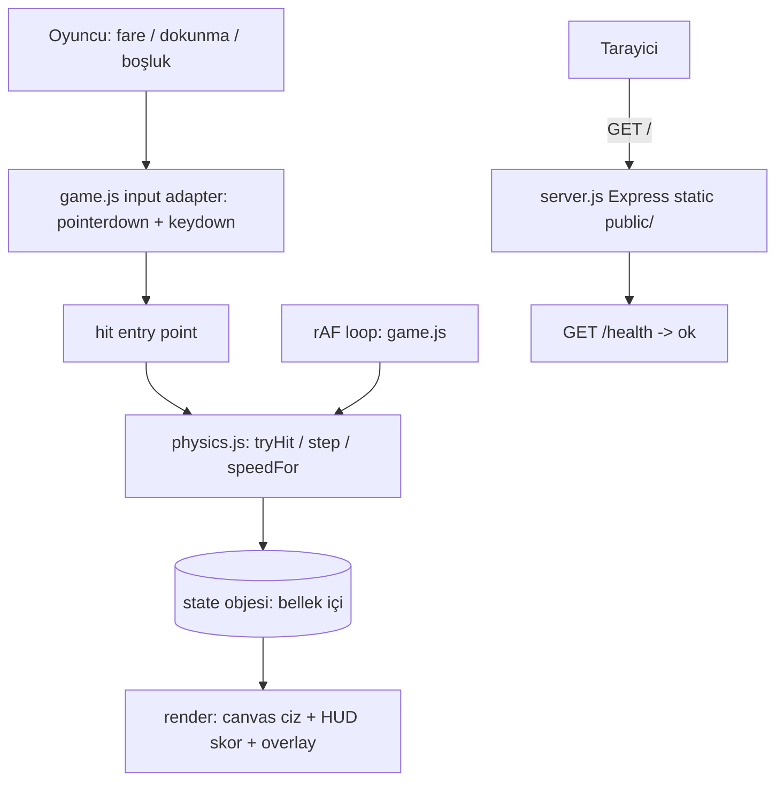

# 05 — Mimari Tasarım: ball-bounce

- Tarih: 2026-07-31 | Mod: AUTOPILOT | Profil: LITE
- Girdi: `docs/03-requirements.md`, `docs/04-solution-analysis.md`, DL-04-001, DL-04-002

## Genel bakış
Tek sayfalık istemci oyunu: bir `<canvas>`, `requestAnimationFrame` döngüsü ve saf (DOM'suz) fizik
çekirdeği. Sunucu yalnız statik dosya servisi + `/health`; oyun state'i **hiç** sunucuya çıkmaz.
Ana ayrım: **`physics.js` (saf, test edilebilir çekirdek)** ile **`game.js` (I/O adaptörü: canvas,
input, HUD)**. Çekirdek tarayıcı API'si bilmez; adaptör oyun kuralı bilmez.

## Bileşen görünümü


## Veri akışı (bir vuruş ve oyun bitişi)
```mermaid
sequenceDiagram
  participant U as Oyuncu
  participant G as game.js
  participant P as physics.js
  participant C as Canvas
  U->>G: pointerdown / Space
  G->>P: tryHit(state, x, y, now)
  P-->>G: accepted true, score+1, vy = -V0*sqrt(k)
  G->>C: ayni rAF karesinde HUD skoru cizilir
  loop her kare (~16ms)
    G->>P: step(state, dt)
    P-->>G: y, vy guncellendi; grounded kontrolu
  end
  P-->>G: grounded true -> phase = over
  G->>C: Oyun bitti overlay + final skor + Yeniden basla
```

## Dosya / modül yapısı
| Yol | Sorumluluk |
|-----|------------|
| `server.js` | Express: `express.static('public')` + `GET /health` → `{status:"ok"}`. Stateless. |
| `package.json` | `"type":"module"`, tek dep `express` (sabit sürüm), `start` / `test` script'leri |
| `public/index.html` | `<canvas>` + HUD (skor) + overlay (`ready` / `over`), `<script type="module">` |
| `public/style.css` | Tam ekran yerleşim, `touch-action:none` (mobil gecikme/scroll yok) |
| `public/game.js` | rAF döngüsü, canvas render, DPR ölçekleme, input bağlama, tek `hit()` girişi |
| `public/physics.js` | **Saf ESM fonksiyonlar:** `createState`, `step`, `tryHit`, `speedFor`, `isGrounded` |
| `tests/physics.test.js` | `node:test` — `public/physics.js`'i doğrudan import eder (DOM/tarayıcı gerekmez) |
| `Dockerfile` | Faz 12'de eklenir (`node:alpine`, `EXPOSE`, `npm start`) — bu fazda yalnız yer tutucu |

`physics.js` tarayıcıya da Node testine de **aynı ESM dosyası** olarak girer; build/transpile adımı yok (NFR-3).

## Veri modeli (Oyun state — tek bellek-içi obje)
```js
export const PHASE = { READY: 'ready', PLAYING: 'playing', OVER: 'over' }; // oyun durumu enum

const state = {
  phase: PHASE.READY,   // 'ready' | 'playing' | 'over'
  score: 0,             // FR-2: sektirme sayısı
  speed: 1.0,           // k — kademeli zorluk katsayısı (FR-5)
  ball: { x: 240, y: 180, vx: 0, vy: 0, r: 24 },  // logical px, px/s
  lastHitAt: 0,         // ms — vuruş cooldown'u
  world: { w: 480, h: 720, groundY: 700 }         // logical koordinat sistemi
};
```
Sabitler (`physics.js`): `G0=1400 px/s²`, `V0=620 px/s`, `VMAX=1200 px/s`, `DT_MAX=1/30 s`,
`HIT_PAD=26 px`, `HIT_COOLDOWN_MS=120`, `K_STEP=0.04`, `K_EVERY=5`, `K_MAX=1.8`.
Kalıcılık yok: `localStorage` / `sessionStorage` / cookie / `fetch` **kullanılmaz** (NFR-4).

## Girdi işleme (tek nokta)
FR-6'nın üç kontrol şeması tek `hit(px, py, now)` çağrısında birleşir:
| Kaynak | Bağlama | Konum bilgisi |
|--------|---------|----------------|
| Fare + dokunma + kalem | `canvas.addEventListener('pointerdown')` (Pointer Events masaüstü+mobili tek olayda kapsar) | Olayın canvas-yerel `x,y`'si |
| Boşluk tuşu | `window.addEventListener('keydown')`, `code === 'Space'`, `preventDefault()` | Konumsuz → topun kendi merkezi geçilir (kesin isabet sayılır) |

`tryHit` kabul kuralı (DL-03-001 "geniş görsel-kesişim"):
`phase === 'playing'` **ve** `now - lastHitAt >= 120ms` **ve** `vy > -150` (top zaten güçlü yukarı
gitmiyorsa) **ve** `dist((px,py),(ball.x,ball.y)) <= r + HIT_PAD` (= 50 px yarıçaplı cömert hitbox).
Kabul → `score++`, `vy = -V0*sqrt(k)`, `vx = clamp(vx + (ball.x - px) * 2.5, -180, 180)` (merkez-dışı
vuruş yana iter; duvarda `x` yansır). `phase === 'ready'` iken herhangi bir girdi oyunu başlatır (skor 0).
`phase === 'over'` iken girdi yalnız overlay'deki "Yeniden başlat"a gider (FR-4: `createState()` ile sıfırlanır).

## Kademeli hız artışı — somut formül (FR-5)
```
k      = min(K_MAX, 1 + floor(score / K_EVERY) * K_STEP)   // 1.00 → 1.80, her 5 skorda +0.04
gEff   = G0 * k                                            // 1400 → 2520 px/s²
impuls = -V0 * sqrt(k)                                     // 620 → 832 px/s
```
`impuls`'un `sqrt(k)` ile ölçeklenmesi **tepe yüksekliğini sabit tutar** (`h = V0²/2G0 ≈ 137 px`) ama
uçuş süresini kısaltır: `T = 2V0/(G0*sqrt(k))` → 0.89 s (k=1) → 0.66 s (k=1.8). Yani oyun ekranı
taşırmadan, yalnız **tepki penceresini daraltarak** zorlaşır; `K_MAX=1.8` üst sınırı skor 100'de
doyar ve oynanamazlığı engeller (DL-04-001 risk-2'nin karşılığı; Faz 11 sınır testi).
`step()` her karede `dt = min(rawDt, DT_MAX)` ve `vy = min(vy + gEff*dt, VMAX)` uygular
(sekme arka plana alınınca birikmiş dt ile tünelleme olmaz); zemin testi eşitlik değil eşiktir: `y + r >= groundY`.

## Teknoloji seçimleri
| Katman | Seçim | Alternatifler | DL referansı |
|--------|-------|---------------|--------------|
| Render + oyun döngüsü | Canvas 2D + `requestAnimationFrame`, sıfır bağımlılık | Phaser/matter.js; DOM+CSS | DL-04-001 |
| Kod organizasyonu | Saf `physics.js` çekirdek + ince `game.js` adaptörü (ESM) | Tek dosya monolit; sınıf hiyerarşisi | DL-05-001 |
| Fizik parametreleri | `sqrt(k)` impuls + `k` yerçekimi, `K_MAX=1.8` tavan | Doğrusal vy artışı; süre-bazlı ivme | DL-05-002 |
| Statik servis | Node + minimal Express, `/health` | nginx-only imaj; çıplak `http` | DL-04-002 |
| Paketleme | `node:alpine` Dockerfile (Faz 12), `127.0.0.1:<host_port>` | — | DL-04-002 |

## NFR ↔ Mimari eşlemesi (kalite kapısı kanıtı)
| NFR | Mimarideki somut karşılığı |
|-----|-----------------------------|
| NFR-1 (vuruş→skor ≤1 sn) | `hit()` senkron: `tryHit` skoru **aynı çağrıda** artırır, HUD **aynı rAF karesinde** çizilir (~16 ms). Vuruş yolunda ağ/async/timer yok; Express bu yolda hiç yer almaz. |
| NFR-2 (zemin→oyun bitti ≤1 sn) | `step()` her karede `y + r >= groundY` eşiğini kontrol eder → `phase='over'` + overlay aynı karede. `DT_MAX=1/30 s` clamp + `VMAX` sınırı ile en kötü tespit gecikmesi ≈33 ms; tünelleme mümkün değil (eşik testi, eşitlik değil). |
| NFR-3 (framework yok, ek derleme yok) | İstemcide **0 runtime bağımlılık**: düz ESM (`<script type="module">`), transpile/bundle adımı yok. Tek npm paketi `express` yalnız sunucuda. `devicePixelRatio` ölçekleme + Pointer Events ile masaüstü/mobil aynı kod yolu. |
| NFR-4 (kalıcı veri yok) | Tüm state tek modül-kapsamlı JS objesinde; `localStorage`/`sessionStorage`/cookie/`fetch` **yok** (Faz 10/11'de statik grep ile doğrulanabilir). Sunucu stateless: yalnız `static` + `/health`, oyun ucu yok, log'a skor yazılmaz. Sayfa yenileme = `createState()` ile sıfır. |

## ADR listesi
- DL-05-001: Modül yapısı — saf `physics.js` çekirdeği + ince `game.js` I/O adaptörü
- DL-05-002: Fizik parametreleri ve kademeli zorluk formülü (`sqrt(k)` impuls, `K_MAX` tavanı)

## Kalite kapısı raporu
- "Kritik NFR'lerin mimaride karşılığı var" → ✅ NFR-1..NFR-4'ün dördü de yukarıdaki eşleme tablosunda somut mekanizmaya bağlandı (senkron hit yolu, kare-başına eşik testi + dt clamp, sıfır-bağımlılık ESM, state'siz istemci/sunucu).
- "FR kapsaması" → ✅ FR-1 (`tryHit`), FR-2 (HUD + `score`), FR-3 (`isGrounded` → `PHASE.OVER`), FR-4 (`createState()` reset), FR-5 (`speedFor` formülü), FR-6 (Pointer Events + Space tek `hit()` girişinde).
- "Mermaid diyagramları" → ✅ bileşen görünümü (`graph TD`) + veri akışı (`sequenceDiagram`).
- Decision Log: `decisions/DL-05-001-module-structure.md`, `decisions/DL-05-002-physics-parameters.md`
