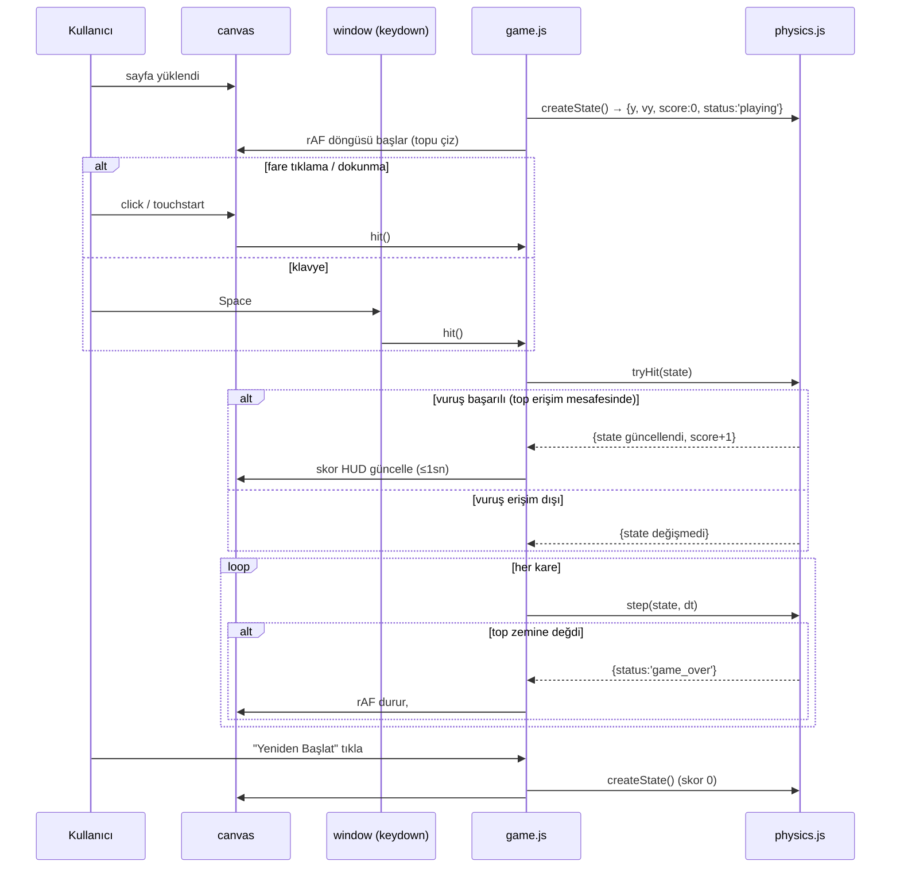

# 06 — UI/UX: ball-bounce

- Tarih: 2026-07-31 | Mod: AUTOPILOT | Profil: LITE
- Ürün tipi: web → tek sayfa (statik HTML + Canvas 2D + vanilla JS — bkz. `docs/05-architecture.md`)

Girdi: `docs/03-requirements.md` (FR-1..6, NFR-1..4), `docs/05-architecture.md`.

## Yüzey sözleşmesi (tek ekran)
| Öğe | Rol | Etkileşim | İlgili FR/NFR |
|-----|-----|-----------|----------------|
| Başlık `<h1>` "Top Sektirme" | Sayfa kimliği | — | — |
| Oyun alanı `<canvas id="game">` | Top + zemin çizimi | Tıklama/dokunma → `hit()` | FR-1, FR-6 |
| Skor `
` | Anlık skor | Vuruşta güncellenir | FR-2 |
| Oyun-bitti katmanı `
` | Final skor + "Yeniden Başlat" `<button id="restart">` | `game_over` durumunda görünür; tıkla → `reset()` | FR-3, FR-4 |
| Klavye dinleyicisi (`window`, `keydown: Space`) | Alternatif vuruş | Boşluk tuşu → `hit()` (görsel öğe yok) | FR-6 |

Tüm kontrol yolları (`click`/`touchstart`/`keydown:Space`) tek bir `hit()` fonksiyonuna yönlenir (bkz. `docs/05-architecture.md` — Girdi işleme).

## Ana akış — uçtan uca (kalite kapısı)

## Çıktı/görsel şablonları
- **Başlangıç durumu:** Top ekranın üst-orta bölgesinde, skor "0", `#game-over` gizli.
- **Oynama sırasında:** Top emoji/sprite (🏀 veya benzeri, DL-06-001) her karede yeniden çizilir; skor her başarılı vuruşta ≤1sn içinde artar (FR-2).
- **Oyun bitti durumu:** Top zeminle temas edince canvas donar, `#game-over` görünür olur: "Oyun bitti — Skor: N" + "Yeniden Başlat" butonu (≤1sn, FR-3).
- **Zorluk artışı (görsel ipucu yok, davranışsal):** Top hızı arttıkça oyuncu yalnız daha sık vuruş yaparak fark eder — ek UI göstergesi v1 kapsamı dışı (brief'te istenmedi).
- **Hata/kenar durumları:** Vuruş erişim dışıysa (top uzakta) hiçbir görsel/skor değişikliği olmaz; JS devre dışıysa `<noscript>` "Bu oyun JavaScript gerektirir" mesajı.

## Tasarım notları
- **Palet/kontrast:** Açık/nötr arkaplan, top emoji kendi rengini taşır; skor metni yüksek kontrastlı (≥4.5:1 hedefi).
- **Boyut:** Bağımlılıksız `index.html` + `game.js` + `physics.js` + 1 CSS, derleme yok (NFR-3).
- **Responsive:** Canvas `devicePixelRatio` ile ölçeklenir, viewport genişliğine göre `max-width` ile ortalanır — masaüstü + mobil dokunma aynı yüzey (FR-6).
- **Ton:** Minimalist, coinflip/dice-game/snake-game ile tutarlı düz-renk arayüz; emoji yalnız top görselinde (brief Q5).

## Kalite kapısı raporu
- "Ana kullanıcı akışları uçtan uca çizildi" → ✅ GEÇTİ — tek ana akış (yükle → vuruş → skor → oyun bitti → yeniden başlat) Mermaid ile uçtan uca verildi; başlangıç/oynama/oyun-bitti/hata kenar durumları tanımlandı.
