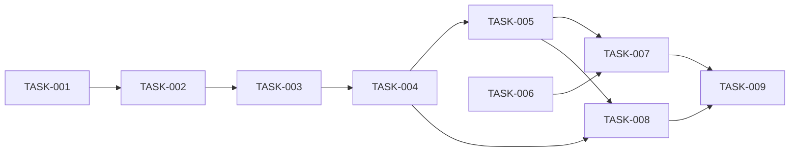

# 08 — Planlama: ball-bounce

- Tarih: 2026-07-31 | Mod: AUTOPILOT | Profil: LITE

> LITE: milestone + önceliklendirilmiş backlog.

## Milestone'lar
| M | Hedef | Kapsanan FR'ler | Hedef tarih |
|---|-------|-----------------|-------------|
| M1 | Oynanabilir ball-bounce (tüm modüller + test + statik yüzey) | FR-1..FR-6 | 2026-07-31 |

## Backlog (önceliklendirilmiş)

### [M1] TASK-001: physics.js çekirdek — createState/step/tryHit/speedFor
- **Tahmin:** ≤1 gün
- **Bağımlılık:** —
- **FR:** FR-1, FR-5
- **Kabul:** `createState` başlangıç değerlerini (y, vy, score:0, status:'playing') üretir; `step(state, dt)` yerçekimini uygular ve `dt` clamp'lenir (NFR-2); `speedFor(score)` kademeli, üst-sınırlı katsayı döner (test+impl, red→green).

### [M1] TASK-002: physics.js — tryHit (isabet toleransı + cooldown) + isGrounded
- **Tahmin:** ≤1 gün
- **Bağımlılık:** TASK-001
- **FR:** FR-1, FR-2
- **Kabul:** Top erişim mesafesindeyken vuruş başarılı olur, skor 1 artar; erişim dışıysa state değişmez; zeminle temas `status:'game_over'` üretir (test+impl, red→green).

### [M1] TASK-003: game.js — rAF döngüsü + canvas render + HUD
- **Tahmin:** ≤1 gün
- **Bağımlılık:** TASK-002
- **FR:** FR-2, FR-3
- **Kabul:** Her karede `step` çağrılır, top+skor çizilir; `textContent`/canvas `fillText` kullanılır, `innerHTML` YOK (SEC-7) (test+impl, red→green).

### [M1] TASK-004: game.js — tek-nokta girdi (click/touchstart/Space) + hit()
- **Tahmin:** ≤1 gün
- **Bağımlılık:** TASK-003
- **FR:** FR-1, FR-6
- **Kabul:** Fare/dokunma/klavye üç yol da aynı `hit()`'i çağırır; hiçbiri diğerini engellemez (test+impl, red→green).

### [M1] TASK-005: game.js — oyun-bitti overlay + yeniden başlatma
- **Tahmin:** ≤1 gün
- **Bağımlılık:** TASK-004
- **FR:** FR-3, FR-4
- **Kabul:** `status:'game_over'` olunca overlay ≤1sn içinde görünür + final skor; "Yeniden Başlat" `createState()` ile sıfırlar (test+impl, red→green).

### [M1] TASK-006: server.js — Express statik servis + /health + güvenlik header'ları
- **Tahmin:** ≤1 gün
- **Bağımlılık:** —
- **FR:** Faz 5 mimarisi
- **Kabul:** SEC-1, SEC-2, SEC-3, SEC-4, SEC-5, SEC-10 uygulanır (test+impl, red→green).

### [M1] TASK-007: index.html + styles.css statik yüzey
- **Tahmin:** ≤1 gün
- **Bağımlılık:** TASK-005, TASK-006
- **FR:** Faz 6 sözleşmesi
- **Kabul:** CSP uyumlu (inline script yok, `game.js`/`physics.js` ayrı dosya), responsive canvas (`devicePixelRatio`).

### [M1] TASK-008: Entegrasyon testleri (vuruş-skor invariantı, oyun-bitti geçişi, çoklu girdi)
- **Tahmin:** ≤1 gün
- **Bağımlılık:** TASK-004, TASK-005
- **FR:** NFR-1, NFR-2
- **Kabul:** Skor güncellemesi ≤1sn davranışsal olarak doğrulanır (senkron çağrı); oyun-bitti geçişi %100 tetiklenir; her üç girdi yolu ayrı ayrı test edilir.

### [M1] TASK-009: npm test yeşil + coverage + DL-09-001 + kapı doğrula
- **Tahmin:** ≤1 gün
- **Bağımlılık:** TASK-007, TASK-008
- **FR:** Faz 9 kapanışı
- **Kabul:** `npm test` tümü yeşil, coverage ≥%70, DL-09-001 yazıldı, `verify-gate.mjs 9 --level all` geçti.

## Bağımlılık grafı (kalite kapısı: çevrimsiz)

## Kalite kapısı raporu
- "Her task 1 günden küçük" → ✅ (her TASK "Tahmin: ≤1 gün")
- "Bağımlılık grafı çevrimsiz" → ✅ (doğrusal zincir + TASK-006/TASK-008 yan dalları, geri dönüş yok)
